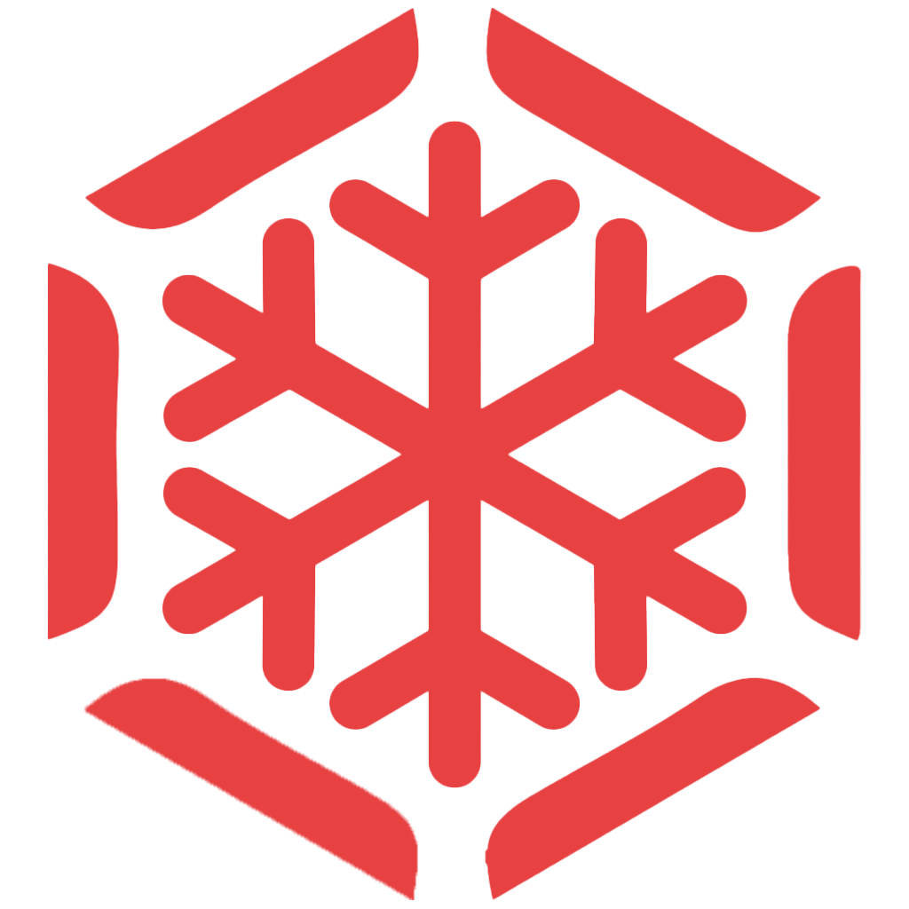

# SnowMind

**Autonomous, non-custodial USDC yield on Avalanche.**

Deposit USDC and an on-chain AI agent continuously rebalances it into the best risk-adjusted yield across Avalanche's leading lending protocols — within strict on-chain safety rules. You remain in full control of your funds at all times.

[Website](https://snowmind.xyz) &nbsp;·&nbsp; [App](https://app.snowmind.xyz) &nbsp;·&nbsp; [Documentation](https://docs.snowmind.xyz) &nbsp;·&nbsp; [X](https://x.com/snowmind_xyz) &nbsp;·&nbsp; [LinkedIn](https://www.linkedin.com/company/snowmindxyz/)

---

## Overview

SnowMind is a non-custodial yield optimizer for USDC on the Avalanche C-Chain.

- Deposit USDC — no complex setup and no manual yield-chasing.
- An AI optimizer continuously routes funds to whichever trusted protocol offers the best risk-adjusted return at any given moment.
- Allocations rebalance automatically as rates shift across protocols.
- Withdraw at any time. Every withdrawal requires a fresh signature from your own wallet, so no other party can ever move your funds.

## Supported protocols

SnowMind routes capital exclusively to established Avalanche lending protocols:

**Aave V3 · Spark · Euler V2 · Silo · Benqi**

Before any allocation, each protocol is health-checked for utilization, TVL stability, rate volatility, and de-pegging. Yields are weighted by risk, unhealthy protocols are skipped, and SnowMind can fully exit a protocol the moment conditions deteriorate.

## Security

- **Non-custodial.** Your wallet always owns the funds. SnowMind never holds your keys.
- **Dedicated smart account.** Each user is assigned their own ZeroDev smart account.
- **Scoped permissions.** The agent can only deposit, rebalance, or return funds to you. It cannot send your money anywhere else.
- **Atomic execution.** Every rebalance executes as a single all-or-nothing on-chain transaction, so funds never stall mid-move.
- **Continuous monitoring.** Daily on-chain reconciliation, operator kill switches, and real-time alerts on every critical event.

The only risk to your USDC is the inherent risk of the underlying lending protocols — the same exposure you would take by depositing into them directly. SnowMind adds no new risk; it routes you to the best risk-adjusted yield within strict guardrails.

## Audits

SnowMind's smart account architecture and backend have been security-audited by [Firepan](https://firepan.com/).

## Fees

- **Beta: no fees.** You keep 100% of your yield.
- **Thereafter: 10% of profit only** — never charged on principal, and never on a loss.

## Technology

| Layer | Stack |
|---|---|
| Website and app | Next.js 15 (Vercel) |
| Backend and optimizer | FastAPI, Python (Railway) |
| Execution | Node.js, ERC-4337 account abstraction (ZeroDev, Pimlico) |
| Network | Avalanche C-Chain (`43114`) |

## Backed and supported by

- [Avalanche](https://www.avax.network/) ([@avax](https://x.com/avax)) — built on the Avalanche C-Chain
- [Team1 USA](https://x.com/Team1USA_)

---

SnowMind is a non-custodial DeFi application. Using DeFi protocols carries risk; please conduct your own research. Nothing here constitutes financial advice.

